    #laporan Posttes-1
## deskripsi program
program yang saya buat adalah program CRUD yang memiliki judul "Sistem data list karakter dari game  arknights" penjelasan CRUD pada program ini dapat dilihat di bawah ini
    
## Class Operator
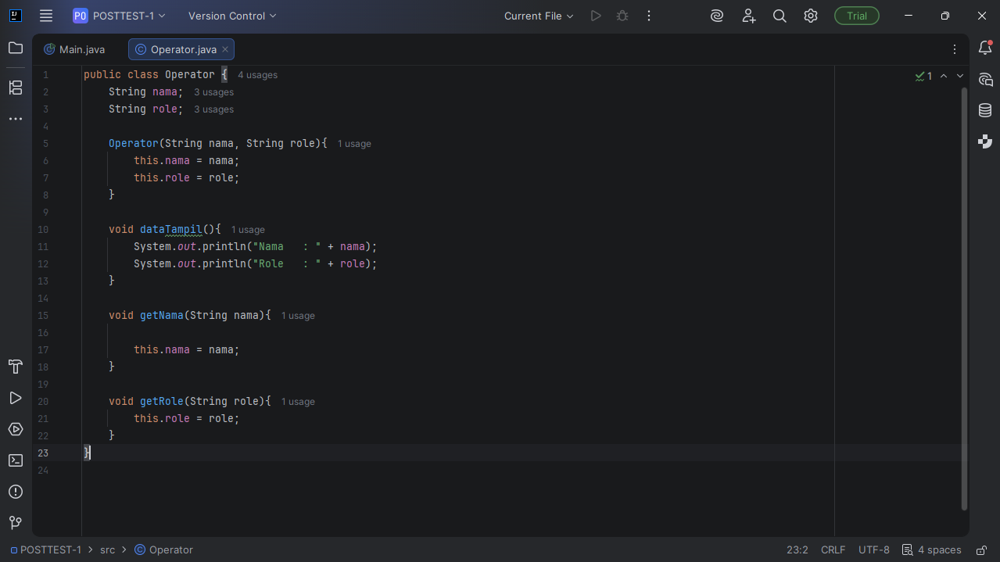

pada gambar di atas merupakan tampilan dari class operator yang berisikan variabel nama dan role, kemudian ada contrustor yang digunakan untuk mengisi nama dan role saat ditambahkan "Operator(String nama, String role)", kemudian void dataTampil() digunakan untuk menampilkan data saat method dipanggil di class Main, kemudian ada getNama dan getRole yang digunakan untuk mengubah nilai pada saat data di update.

## Import dan Class Main
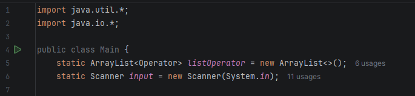

pada gambar diatas menampilkan import yang dimana import itu digunakan untuk mengimpor semua class yang ada di package java, kemudian ada Arraylist perintah ini digunakan untuk menyimpan 
semua data operator ke dalam array, dan Scanner adalah perintah yang digunakan untuk membaqca input user.

## void main
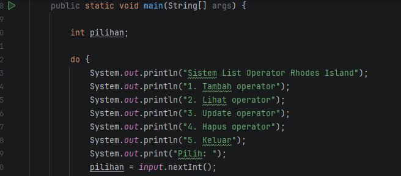
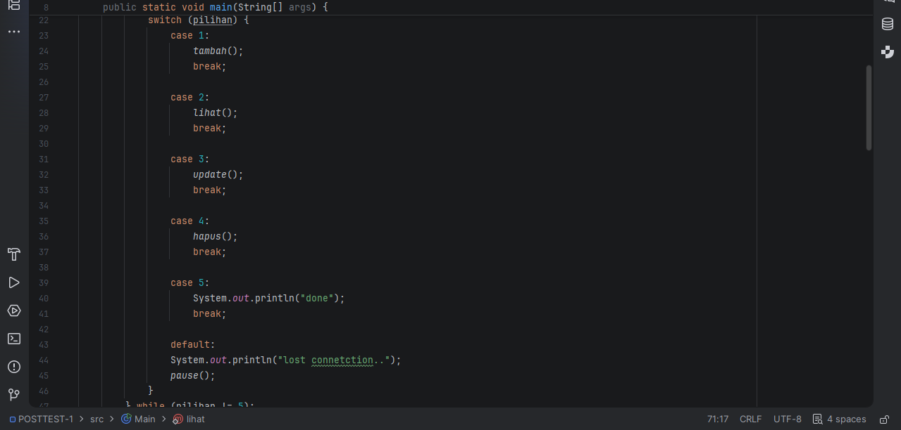

pada gambar di atas merupakan void main atau tempat semua program dijalankan untuk pertama kali, di dalam void main pada gammbar di atas terdapat beberapa hal yaitu ada menu sistem, kemudian terdapat perulangan yang menggunakan do while, dan terdapat switch case yang digunakan untuk mengontrol alur program berdasarkan beberapa kemungkinan nilai.

## Tambah
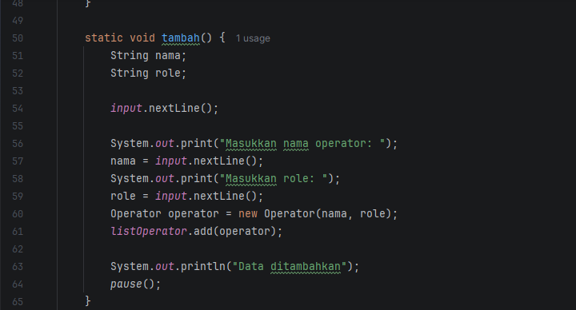

pada gambar diatas merupakan sistem crud untuk tambah yang dimana user diminta untuk memasukkan nama dan role pada operator

## Lihat
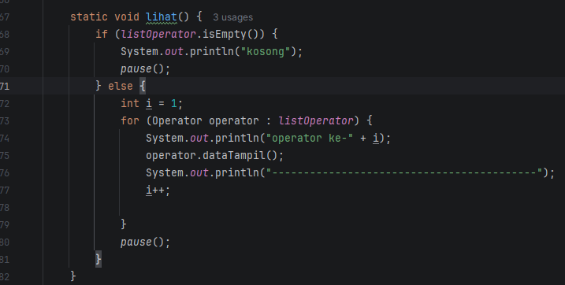

pada gambar diatas merupakan bagian crud yang digunakan untuk melihat semua data yang sudah disimpan dalam array jika tidak ada data maka output akan kosong

## Update
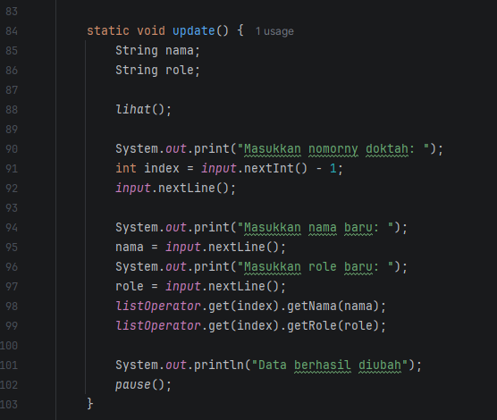

pada gambar diatas merupakan perintah update yang dimana pertama user diminta untuk memilih nomor operator yang ingin di update kemudian user harus memasukkan nama dan role baru pada operator

## Hapus
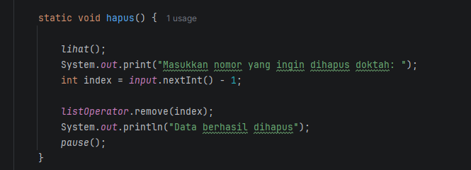

pada gambar diatas merupakan perintah hapus yang dimana sama seperti update pertama user diminta untuk memilih nomor operator yang ingin dihapus kemudian sistem akan menghapus operator tersebut.

## Pause
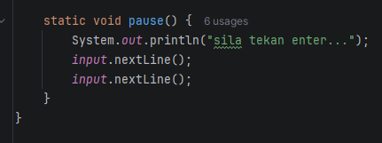

pada gambar diatas merupakan penerapan kode untuk memberi pause pada program dan meminta user untuk tekan enter.

## POSTTEST 2
## ENCAPSULATION
## Penerapan Access Modifier

pada gambar di atas merupakan penerapan Access Modifier pada program crud java yang dimana terdapat 3 access modifier yaitu public, private, dan protected. penerapan public dilakukan pada method operator, private diterapkan pada variabel nama, dan protected diterapkan pada variabel role.

## Getter dan Setter

pada gambar di atas merupakan penerapan setter getter pada program ini, yang dimana ini dilakukan karena variabel nama dan role telah diproteksi menggunakan access modifier private dan protected, maka kelas lain tidak dapat mengaksesnya secara langsung, jadi kegunaan setter dan getter pada program ini adalah
setter: digunakan untuk memberikan atau memperbarui nilai atribut dalam tugas ini Setter dipanggil pada fungsi Create (Tambah Data) dan Update (Ubah Data).

getter: digunakan untuk membaca atau mengambil nilai dari atribut dalam tugas ini Getter dipanggil pada fungsi Read (Lihat Data) untuk menampilkan daftar operator

## Penerapan setter pada update

pada gambar diatas merupakan penerapan pemanggilan setter pada update yang ditandai dengan setNama dan setRole.

## Output
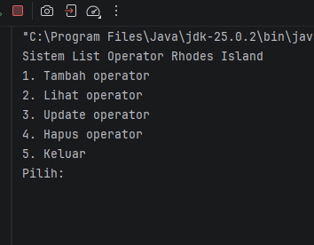
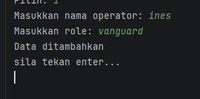
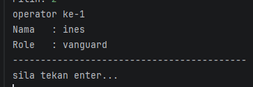
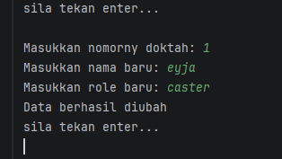
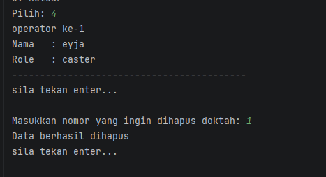
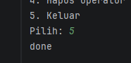

